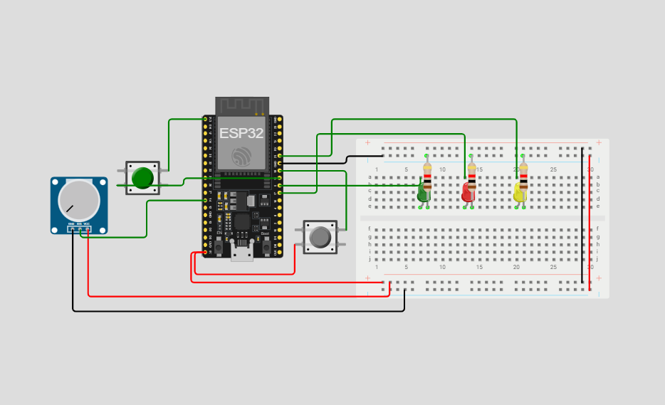

# Introdução a Programação: Projeto Final com Introdução a Engenharia

## Equipe
- Thalytta Fernandes Damiani (2025004602)
- Kaique Yuri Gomes Fernandes (2025008165)
- Luiz Otavio Dantas de Oliveira (2025006590)
- Murilo Alexandre Ribeiro (2025002297)
- Thiago Augusto Martins Dias (2024012305)

## Tema do Projeto
Um sistema de automação para triagem de malas em aeroportos, com o objetivo de tornar o processo mais rápido, eficiente e seguro. A ideia é criar uma solução capaz de identificar, classificar e direcionar automaticamente as bagagens.

## Fase 1: Pesquisa e Planejamento
### Problema
Os processos atuais de triagem de bagagem em aeroportos envolvem etapas manuais, suscetíveis a erros e lentidão, além de riscos de segurança em casos de excesso de peso ou bagagem não declarada.

### Objetivo
Desenvolver uma simulação funcional de um sistema automatizado que represente as etapas de triagem de bagagens no aeroporto. O projeto visa demonstrar como a tecnologia pode transformar o processo, tornando-o mais eficiente e seguro.

### Sensores e Atuadores
- **Potenciômetro:** Simula o valor de peso da bagagem de forma analógica, permitindo ajustes manuais para diferentes cenários de teste.
- **Botão:** Simula a interação do cliente com o totem de autoatendimento no aeroporto.
- **Notebook:** Usado como interface adicional para entrada de dados e simulação das opções disponíveis ao passageiro, como seleção de tipo de passagem ou bagagem extra.
- **Alavanca:** Simula o chamado da atendente.

## Diagrama em Blocos

Ao apertar o botão, é iniciada a triagem. O cliente deve selecionar o voo, depois selecionar a quantidade de malas. O potenciômetro serve para simular a balança que pesa as bagagens.

## Fase 2: Implementação

### Diagrama Esquemático

A balança no protótipo será simulada pelo potenciômetro, e os LEDs foram utilizados no esquemático apenas para testar as conexões.

## Fase 3: Documentação e Implementação

### Foto do Protótipo

### Vídeo do Funcionamento
<video width="320" height="240" controls>
  <source src="./igm/video.mp4.mp4" type="video/mp4">
</video>

### Apresentação de Slides
[Acesse a apresentação no Canva](https://www.canva.com/design/DAGsgLRd9uo/cUJDnLFe_8s644AO9DIBEw/edit?utm_content=DAGsgLRd9uo&utm_campaign=designshare&utm_medium=link2&utm_source=sharebutton)
